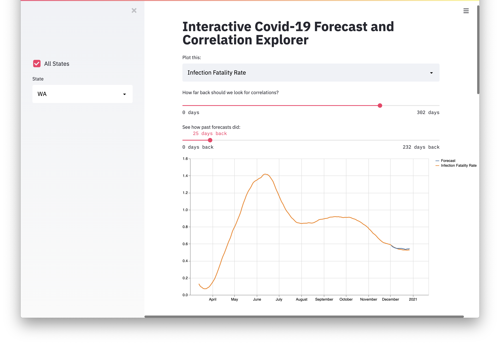
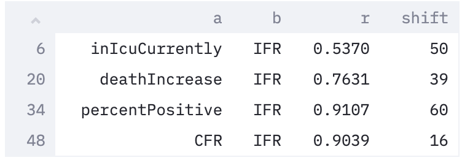

# Interactive Covid-19 Forecast and Correlation Explorer

## How is this forecast made?

This forecast is a weighted average of correlated variables. *shift* is the number of days *a* is shifted forward, and *r* is the [Pearson correlation coefficient](https://en.wikipedia.org/wiki/Pearson_correlation_coefficient) between shifted *a* and *b*.

The model searches every combination of *a*, *b*, and *shift* for the highest *r* values. Only correlations *>0.5* are used. *r* is used to weight each component of the forecast, and each component is scaled and aligned to the forecasted variable *b*. The forecast length is the average *shift* weighted by the average *r*.

You can choose two variables and see if they are correlated.

Infection fatality rate is calculated using the formula described by https://covid19-projections.com/estimating-true-infections-revisited.

Data is pulled daily from https://covidtracking.com

Mobility data is from [google.com/covid19/mobility](https://www.google.com/covid19/mobility/)

## To Do

- Score forecasts with MSE or other metric

- Feed correlated variables into ML model for forecasting. Try LSTM, RF, XGBoost

- ~~Add Google mobility data~~

- Add data from https://rt.live

- Try using cointegration instead of correlation

- Cleanup messy code

- PCA, cluster, and TSNE plot different states

- Intra-state correlations
